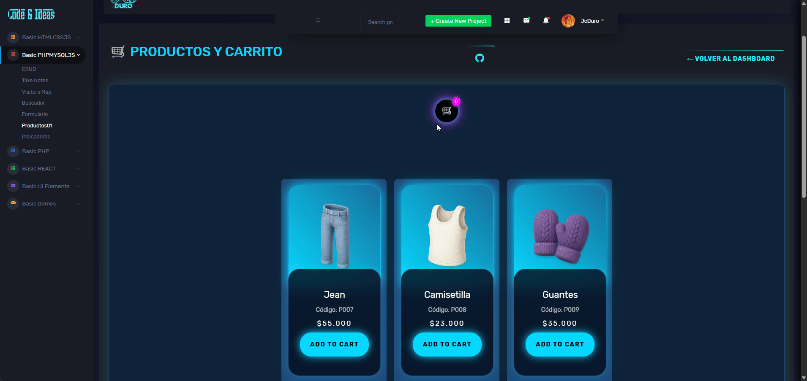

## 🟦 Módulo Product01 - cARRITO

Módulo de catálogo de productos integrado al **dashboard** JcDuroDashBoard, con tarjetas estilo neón, paginación y vista de detalle básica para cada producto [conversation_history:7][web:8].

[🔙 Volver al Dashboard](https://jcduro.bexartideas.com/proyectos/dashjc/index.php)

---

## 📌 Descripción

Este módulo `product01` muestra un listado de productos desde la base de datos y los presenta dentro del layout del dashboard, manteniendo la estética azul neón característica de JcDuroDashBoard [conversation_history:6][web:14].  
Está pensado como base para un mini catálogo / e‑commerce sencillo, donde luego se puede conectar carrito y pedidos [conversation_history:6][web:10].

---

## ✨ Características

- 📦 Listado de productos con nombre, código, precio e imagen, cargados dinámicamente desde la API `get_productos_neon.php`.  
- 🛒 Carrito lateral neón con contador de ítems, total general y controles +/− para cada producto.  
- 💰 Precios formateados en pesos colombianos usando `toLocaleString('es-CO')` en frontend.  
- 📱 Diseño responsive integrado al layout del dashboard JcDuroDashBoard.  

## 🔢 Paginación

En este módulo la lógica de paginación se maneja en frontend (vanilla JS) sobre el listado que devuelve la API.  
Si tu proyecto ya tiene una función `loadItem()` para paginar, aquí es donde se conecta con los productos de `get_productos_neon.php`; en caso contrario, este módulo queda listo para mostrar todos los productos en una sola página y se puede ampliar después para limitar ítems por página.


## 🖼️ Vista previa



--- 

## 🚀 Demo
[Productos_Carrito_Neon](https://jcduro.bexartideas.com/proyectos/dashjc/product01/prod.php)


---

## 📊 Lenguajes y Herramientas

[](https://skillicons.dev)

---


## 🗃️ Base de datos

- 🧱 Tabla de productos en MySQL (ejemplo: `productos`), con campos típicos como nombre, precio, descripción y estado 
- 🔗 El módulo `prod.php` consulta esta tabla y arma las tarjetas dentro del dashboard usando tu conexión actual (Hostinger / PDO o mysqli, según el proyecto) 


--
-- Estructura de tabla para la tabla `productos_neon`
---

```sql

CREATE TABLE `productos_neon` (
  `id` int(10) UNSIGNED NOT NULL,
  `codigo` varchar(20) NOT NULL,
  `nombre` varchar(100) NOT NULL,
  `precio` decimal(10,2) NOT NULL DEFAULT 0.00,
  `cantidad` int(10) UNSIGNED NOT NULL DEFAULT 1,
  `img` varchar(50) NOT NULL,
  `activo` tinyint(1) NOT NULL DEFAULT 1
) ENGINE=InnoDB DEFAULT CHARSET=utf8mb4 COLLATE=utf8mb4_uca1400_ai_ci;

--
-- Volcado de datos para la tabla `productos_neon`
--

INSERT INTO `productos_neon` (`id`, `codigo`, `nombre`, `precio`, `cantidad`, `img`, `activo`) VALUES
(1, 'P001', 'Toalla', 120000.00, 5, '/proyectos/dashjc/product01/img/01.webp', 1),
(2, 'P002', 'Sudadera', 85000.00, 3, '/proyectos/dashjc/product01/img/02.webp', 1),
(3, 'P003', 'Zapatos', 99000.00, 8, '/proyectos/dashjc/product01/img/03.webp', 1),
(4, 'P004', 'Kimono', 150000.00, 2, '/proyectos/dashjc/product01/img/04.webp', 1),
(5, 'P005', 'Bañador', 60000.00, 10, '/proyectos/dashjc/product01/img/05.webp', 1),
(6, 'P006', 'Buzo', 70000.00, 4, '/proyectos/dashjc/product01/img/06.png', 1),
(7, 'P007', 'Jean', 55000.00, 7, '/proyectos/dashjc/product01/img/07.webp', 1),
(8, 'P008', 'Camisetilla', 23000.00, 11, '/proyectos/dashjc/product01/img/08.png', 1),
(9, 'P009', 'Guantes', 35000.00, 12, '/proyectos/dashjc/product01/img/09.webp', 1),
(10, 'P010', 'Polo', 18000.00, 6, '/proyectos/dashjc/product01/img/10.png', 1),
(11, 'P011', 'Gorra', 15000.00, 3, '/proyectos/dashjc/product01/img/11.png', 1),
(12, 'P012', 'Camisa', 44000.00, 14, '/proyectos/dashjc/product01/img/12.png', 1),
(13, 'P013', 'Blusa', 75000.00, 9, '/proyectos/dashjc/product01/img/13.png', 1),
(14, 'P014', 'Camiseta', 29000.00, 8, '/proyectos/dashjc/product01/img/14.png', 1),
(15, 'P015', 'Vestido', 93000.00, 5, '/proyectos/dashjc/product01/img/15.webp', 1),
(16, 'P016', 'Saco', 100000.00, 4, '/proyectos/dashjc/product01/img/16.png', 1),
(17, 'P017', 'Falda', 60000.00, 10, '/proyectos/dashjc/product01/img/17.webp', 1),
(18, 'P018', 'Pantalon', 57000.00, 3, '/proyectos/dashjc/product01/img/18.webp', 1);
```

---

## 🤝 Contribuir
¡Las mejoras son bienvenidas!
Haz un fork → PR y listo.

--- 

## 📄 Licencia
Libre, usalo como quieras
<div align="center">
  Hecho con 💙 y neones
</div>


```md

